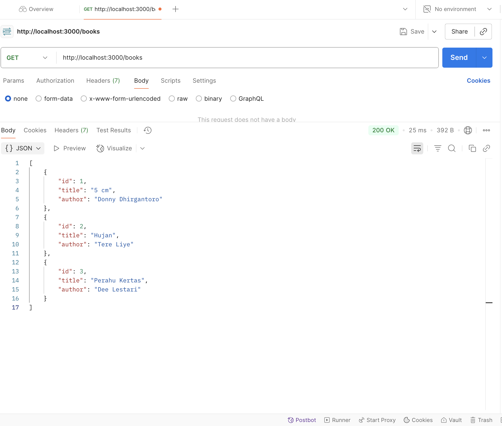
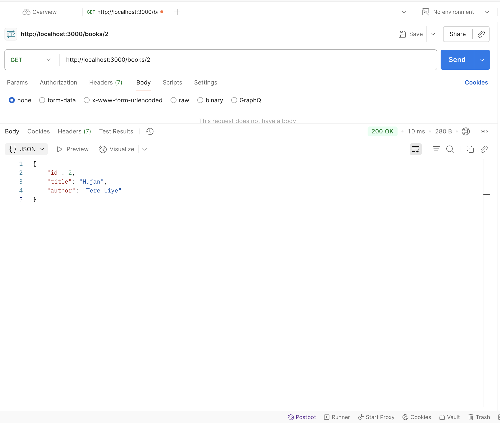
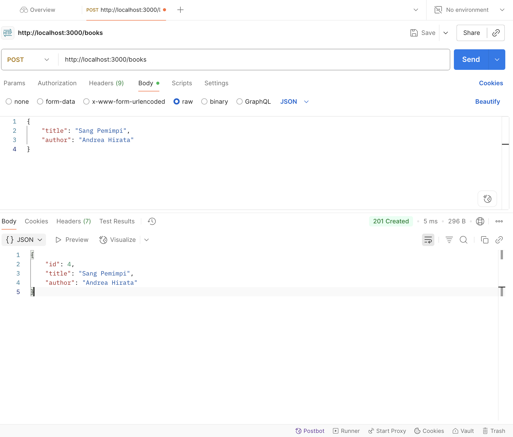
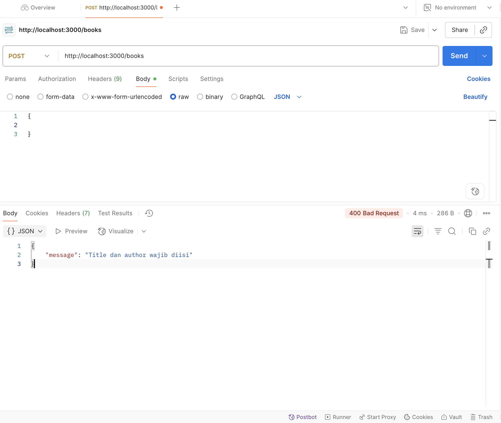
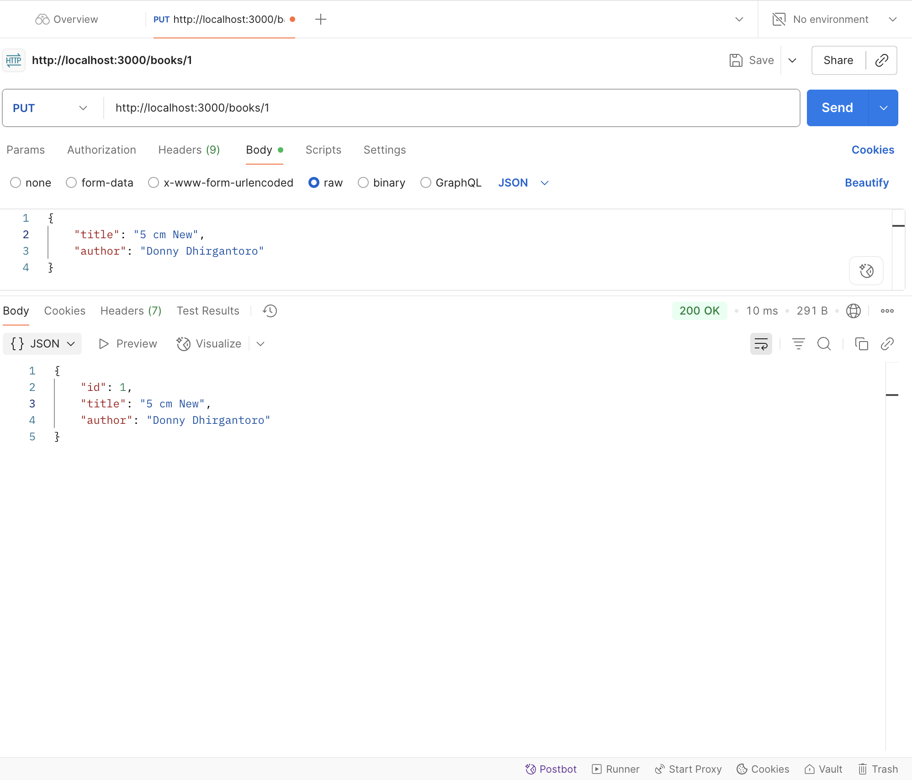
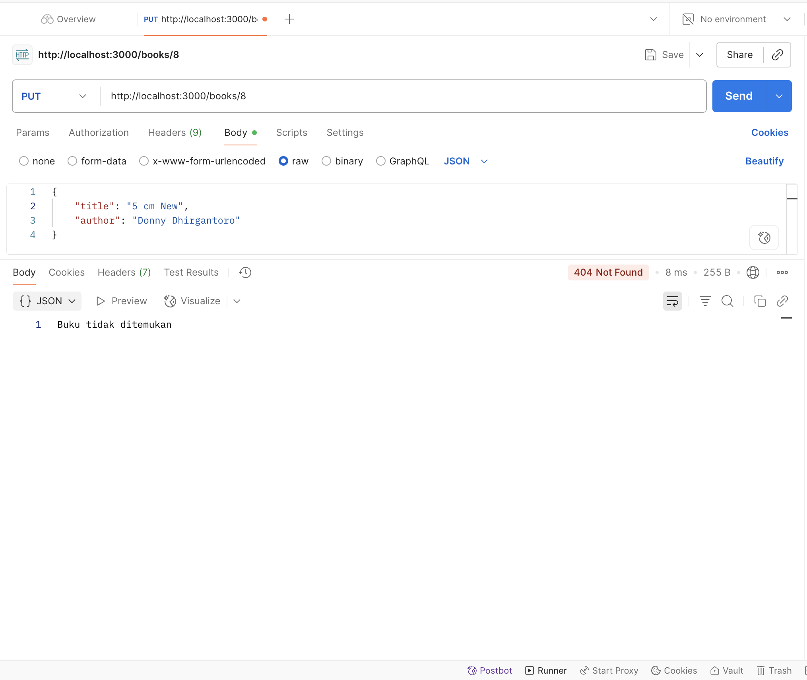
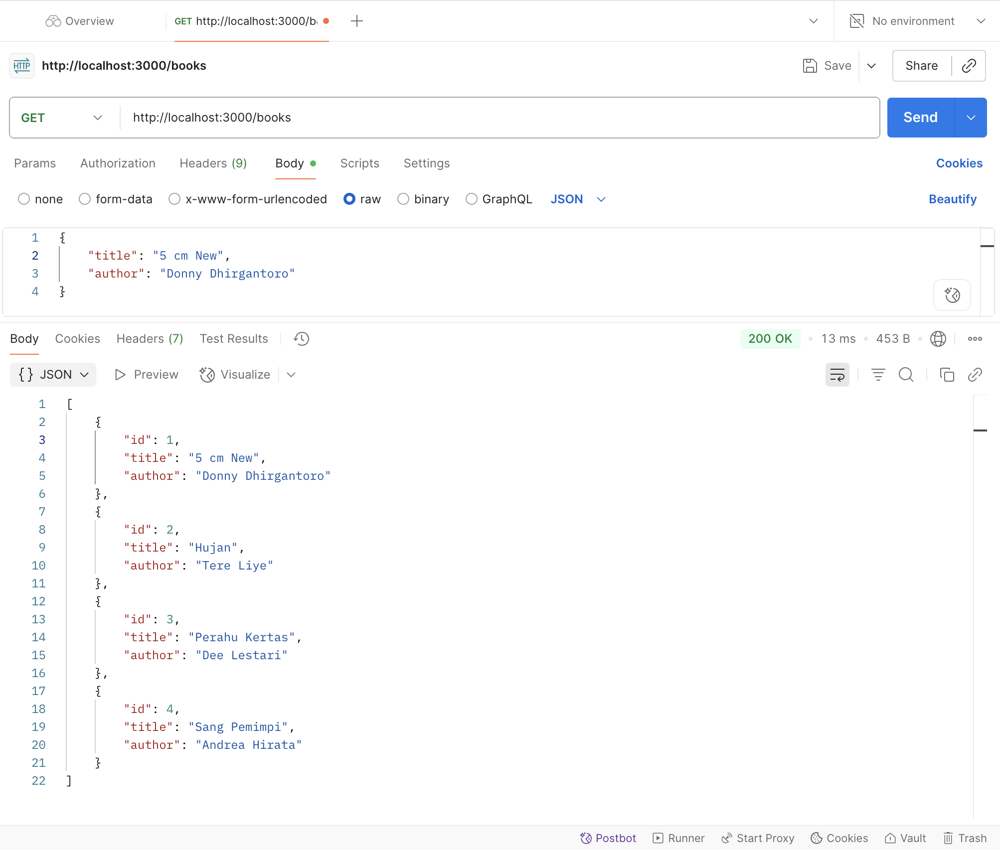
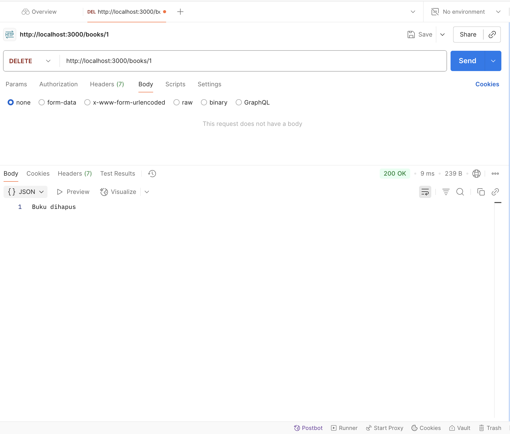
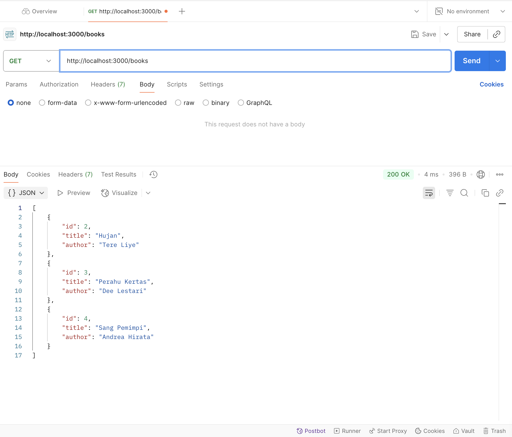

SSan untuk testing saya:
1. Screenshot melihat semua daftar buku (GET /books)
Menampilkan seluruh data buku yang tersimpan pada server

2. Screenshot melihat buku tertentu (GET /books/:id)
Menampilkan detail 1 buku berdasarkan ID

3. Screenshot menambahkan buku baru (POST /books)
Mengirim JSON berisi title dan author untuk menambahkan data buku

4. Screenshot error saat menambah buku tanpa mengisi data (POST /books)
Menampilkan respons error 400 - Bad Request dari middleware validasi

5. Screenshot melihat semua daftar buku setelah dilakukan penambahan (GET /books)
Data buku yang ditambahkan pada POST sebelumnya harus muncul di daftar

6. Screenshot mengedit buku tertentu (PUT /books/:id)
Memperbarui title dan author dari satu buku berdasarkan ID

7. Screenshot error ketika ingin mengedit buku yang tidak terdaftar (PUT /books/:id)
Menampilkan respons 404 - Not Found

8. Screenshot melihat semua daftar buku setelah diedit (GET /books)
Daftar buku menampilkan perubahan terbaru setelah update

9. Screenshot menghapus buku tertentu (DELETE /books/:id)
Menghapus satu buku berdasarkan ID

10. Screenshot melihat semua daftar buku setelah ada buku yang dihapus (GET /books)
Menampilkan daftar buku terbaru setelah penghapusan
